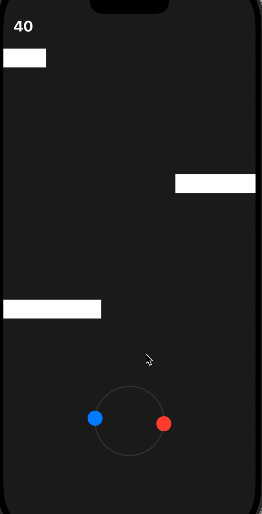
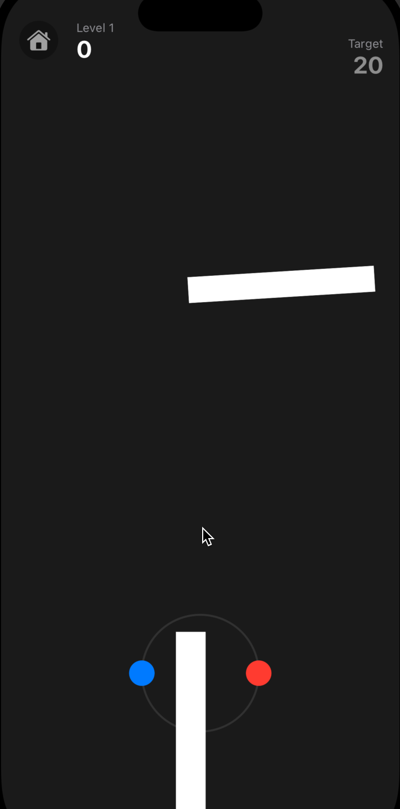
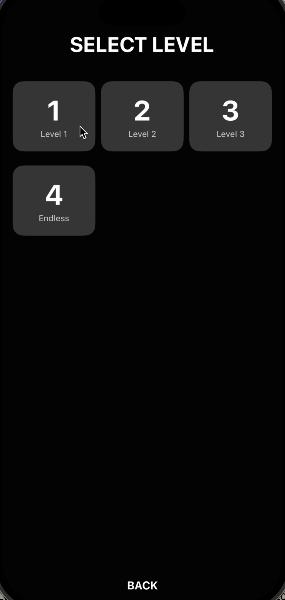

# Two Tones (iOS Native)

A minimalist dual-ball dodging game built with native Swift and SwiftUI.

## Features
- **Dual Control**: Control two balls simultaneously (Red & Blue) by rotating them.
- **Dynamic Obstacles**:
  - Horizontal Moving Blocks
  - Rotating Bars
  - Static Blocks (Left, Right, Center)
- **Audio & Haptics**: Immersive background music and haptic feedback.
- **High Performance**: Native 60 FPS game loop using `Timer` and `SwiftUI`.

## Project Structure
- `ios/App`: The main iOS project directory.
  - `GameEngine.swift`: Core game logic (State, Physics, Collision).
  - `GameView.swift`: Rendering layer using SwiftUI.
  - `App/public/bgm.mp3`: Background music asset.

## How to Run
1. Open `ios/App/App.xcworkspace` in Xcode.
   ```bash
   open ios/App/App.xcworkspace
   ```
2. Select a Simulator (e.g., iPhone 15) or a physical device.
3. Press `Cmd + R` to build and run.

## Requirements
- Xcode 15+
- iOS 15.0+

## Demo
<div style="display: flex; justify-content: space-around;">
  
  
  
</div>