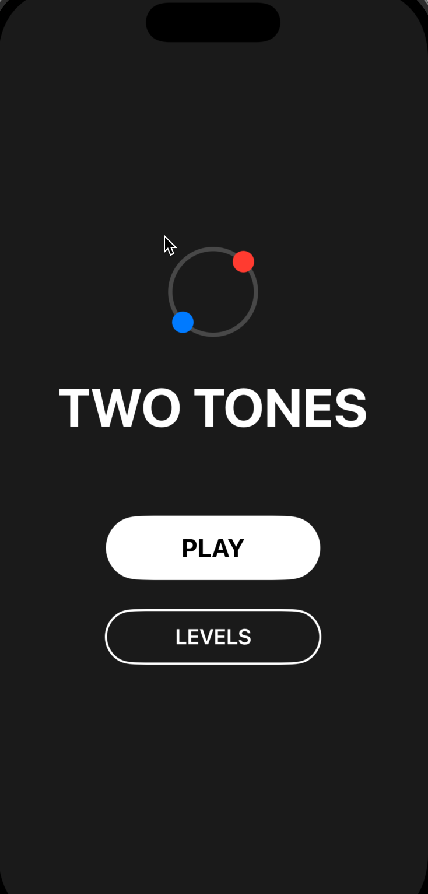

# Two Tones (Cross-Platform)

A minimalist dual-ball dodging game built with native **Swift (iOS)** and **Kotlin (Android)**.

## Features
- **Dual Control**: Control two balls simultaneously (Red & Blue) by rotating them.
- **Dynamic Obstacles**:
  - Horizontal/Vertical Blocks
  - Rotating Bars
  - Diagonal & Cross Shapes
  - Variable Speed & Split Obstacles
- **Level System**: Progressive difficulty with distinct level characteristics.
- **Audio & Haptics**: Immersive background music and haptic feedback.
- **Native Performance**: 
  - **iOS**: SwiftUI + Timer (60 FPS)
  - **Android**: Jetpack Compose + Coroutines (60 FPS)

## Project Structure
- `ios/`: Native iOS project (SwiftUI).
  - `App/GameEngine.swift`: Core game logic.
  - `App/GameView.swift`: Rendering layer.
- `android/`: Native Android project (Jetpack Compose).
  - `app/src/main/java/.../GameEngine.kt`: Core game logic (ViewModel).
  - `app/src/main/java/.../GameView.kt`: Rendering layer (Compose).

## How to Run

### iOS
1. Open `ios/App/App.xcworkspace` in Xcode.
   ```bash
   open ios/App/App.xcworkspace
   ```
2. Select a Simulator (e.g., iPhone 15) or a physical device.
3. Press `Cmd + R` to build and run.

### Android
1. Open **Android Studio**.
2. Select **"Open"** and choose the `android/` folder in this repository.
3. Wait for Gradle Sync to complete (Android Studio will automatically download necessary Gradle versions).
4. Select a Simulator or physical device.
5. Click the green **Run** button (Shift + F10).

> **Note**: If you want background music on Android, copy your `bgm.mp3` file to `android/app/src/main/res/raw/bgm.mp3`.

## Requirements
- **iOS**: Xcode 15+, iOS 15.0+
- **Android**: Android Studio Hedgehog+, Android 7.0 (API 24)+

## Demo
<div style="display: flex; justify-content: space-around;">
  
  
  
</div>